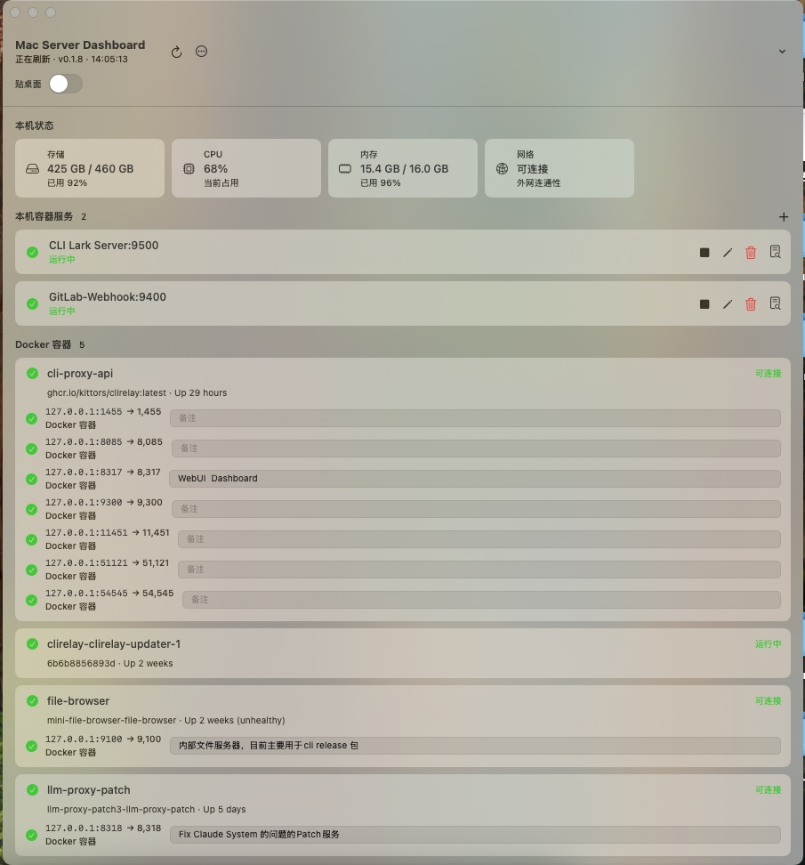

# macOS as Server Dashboard

[简体中文](README.zh-CN.md)

A lightweight dashboard that can sit on the macOS desktop and show local services, Docker containers, and system status at a glance.



## Features

- Desktop pinning: keeps the window at desktop level and visible across Spaces.
- System status: shows storage usage, CPU usage, memory usage, network connectivity, and upload/download speed.
- Service grouping: separates local services from Docker containers.
- Port checks: uses `nc` to test whether TCP ports are reachable.
- Port notes: stores per-port notes in the config file.
- Login item: can install a LaunchAgent to open the dashboard automatically at login.
- Service autostart: can run configured local service commands when the dashboard starts.
- GUI management: add, edit, start, stop, and delete local services from the dashboard.
- Log viewer: view recent local service logs inside the dashboard or open the raw log file.
- In-app updates: checks GitHub Releases, verifies SHA256 checksums, and installs updates.
- Config hot reload: reloads the config file and refreshes the UI when external edits are detected.
- Error prompts: startup failures, service exits, and config read/write failures are shown in dialogs with quick log access.
- Localization: app text follows the system language, with English as the default and Chinese for `zh-*` system languages.

## Run

```bash
swift run MacServerDashboard
```

On first launch, the dashboard creates this config file:

```text
~/Library/Application Support/MacServerDashboard/config.json
```

You can also use `config.sample.json` as a reference.

## Build a Release Package

```bash
scripts/package-release.sh v0.1.8
```

The installer is generated at:

```text
dist/MacServerDashboard-v0.1.8-macos-<arch>.dmg
```

Open the DMG and drag `MacServerDashboard.app` into `Applications`.

Release packages are ad-hoc codesigned so macOS does not treat the app bundle as damaged. To fully remove Gatekeeper prompts, sign with an Apple Developer ID certificate and notarize the app.

## Publish a GitHub Release

Releases are tag-driven: locally, create and push a version tag; GitHub Actions builds on a macOS runner, generates SHA256 checksums, creates the Release with GitHub CLI, and uploads the assets.

1. Update `AppVersion.current` in `Sources/MacServerDashboard/AppVersion.swift`.
2. Commit all changes and make sure the working tree is clean.
3. Create and push the version tag:

```bash
scripts/release.sh v0.1.8
```

4. GitHub Actions uploads:

```text
MacServerDashboard-v0.1.8-macos-<arch>.dmg
MacServerDashboard-v0.1.8-checksums.txt
```

You can also build locally only for verification:

```bash
scripts/package-release.sh v0.1.8
```

Generated files are placed in `dist/`. The in-app updater reads the latest GitHub Release, downloads the matching `MacServerDashboard-*-macos-*.dmg` asset, and verifies it with the release `checksums.txt`.

## In-App Updates

Use the top-right menu and choose "Check for Updates". The dashboard reads the latest GitHub Release. If a newer version is available, the user can install it; the dashboard downloads the current-architecture DMG, verifies SHA256, replaces the current `MacServerDashboard.app`, shows progress, and restarts automatically.

## Install Login Item

You can install the login item from the top-right dashboard menu, or run:

```bash
chmod +x scripts/install-launch-agent.sh scripts/uninstall-launch-agent.sh
scripts/install-launch-agent.sh
```

Uninstall:

```bash
scripts/uninstall-launch-agent.sh
```

## Configure Local Services

Click the plus button beside the "Local services" group to add a service in the GUI. The "Monitored ports (optional)" fields are only used for connectivity checks and notes; they do not change the start command. You can also declare local services manually in `localServices`:

```json
{
  "id": "homepage",
  "name": "Homepage",
  "command": "npm run dev -- --host 0.0.0.0 --port 3000",
  "workingDirectory": "~/Sites/homepage",
  "autoStart": true,
  "note": "Local Node service",
  "ports": [
    {
      "host": "127.0.0.1",
      "port": 3000,
      "protocolName": "tcp",
      "note": "Homepage HTTP"
    }
  ]
}
```

When a service has `autoStart` set to `true`, the dashboard runs its command on launch. Service output is written to:

```text
~/Library/Logs/MacServerDashboard/
```

When launching services, the dashboard resolves NVM Node paths in this order: the service working directory `.nvmrc`, then `~/.nvm/alias/default`, then the highest installed Node version. It adds only the selected `~/.nvm/versions/node/<version>/bin` to `PATH`. It also adds common paths such as `~/.bun/bin`, `~/.local/bin`, `~/.cargo/bin`, and Docker Desktop CLI paths, so GUI-launched services can find tools such as Node, Bun, Docker, and `lark-cli`.

Python/FastAPI services also prefer `.venv/bin` or `venv/bin` in the working directory, plus common paths such as `~/.pyenv/shims`, `~/.asdf/shims`, and `~/Library/Python/*/bin`. If `uvicorn: command not found` still appears, use `./.venv/bin/uvicorn ...` or `python -m uvicorn ...`.

## Logs

The app log is written to:

```text
~/Library/Logs/MacServerDashboard/app.log
```

Local service logs are stored in the same folder. The top-right menu can open the logs folder or the app log directly.

If a startup log shows that a configured port is already in use, the dashboard only checks the monitored ports configured for that service. It sends `TERM` to the listener process, sends `KILL` if the port is still occupied, then retries the service start once.

## Docker Port Notes

Docker container port notes are stored in `portNotes`. Keys use this format:

```text
host:port/protocol
```

Example:

```json
{
  "portNotes": {
    "127.0.0.1:8080/tcp": "Docker nginx"
  }
}
```
